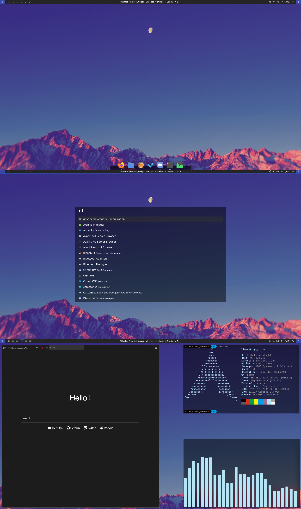

# Llama's Configs
The magic files that stop my system from looking like garbage.

### Firefox
Based upon /u/el013/'s "Ultra Minimal One Line userChrome" but cleaned up a little bit and with some changes to make it appeal to me more. [[/r/FirefoxCSS thread]](https://www.reddit.com/r/FirefoxCSS/comments/g0o4sg/ultra_minimal_one_line_userchrome_macos_firefox/)

Just changelog in the folder for the changes. The general theme is the same but I made a massive number of changes.

## Images

## Changes

### GTK
Color Theme: Materia Dark Compact. - [[GitHub]](https://github.com/nana-4/materia-theme)

Icon Theme: Papirus Dark. - [[GitHub]](https://github.com/PapirusDevelopmentTeam/papirus-icon-theme)

Cursor Theme: OpenZone Ice. - [[GitHub]](https://github.com/ducakar/openzone-cursors)

### Plank
I use the Bytes theme ~~that comes with Plank~~. - [[OpenDesktop]](https://www.opendesktop.org/p/999999/)

### Polybar
My config is a modified Polybar-4 by adi1090x. - [[GitHub]](https://github.com/adi1090x/polybar-themes)

### Rofi
Based on quebin31's rofi theme but without using the whole screen and some other small changes. [[GitLab]](https://gitlab.com/quebin31/dotfiles)
