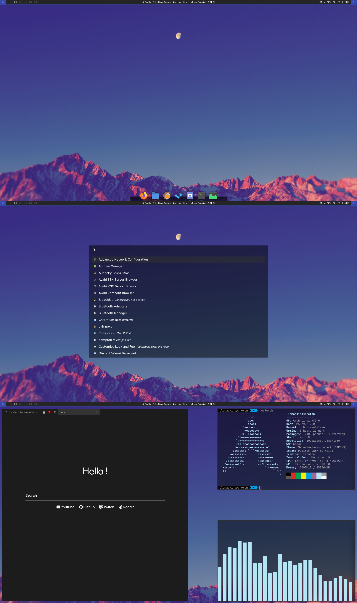

# Llama's Configs

The magic files that stop my system from looking like garbage.

## Required Packages

Arch Repo: `bspwm sxhkd plank termite firefox feh`

AUR: `rofi-git polybar picom-tyrone-git clearine-git`

## Installation

1. Copy the contents of the `etc` folder to `/etc/`.
2. Copy the `.config`, `.ncmpcpp`, `Pictures`, and `Script`, folders to your home directory. Merge folders and replace files if asked.
3. Copy the `.zshrc` file to your home directory, replacing the existing file if asked.
4. Copy the contents of the `Firefox` folder to `~/.mozilla/firefox/<Your Profile>/chrome`. If the `chrome` folder doesn't exist, create it.

## Images

## Additional Changes

### GTK

Color Theme: Materia Dark Compact. - [[GitHub]](https://github.com/nana-4/materia-theme)

Icon Theme: Papirus Dark. - [[GitHub]](https://github.com/PapirusDevelopmentTeam/papirus-icon-theme)

Cursor Theme: OpenZone Ice. - [[GitHub]](https://github.com/ducakar/openzone-cursors)

### Plank

I use the Bytes theme ~~that comes with Plank~~. - [[OpenDesktop]](https://www.opendesktop.org/p/999999/)

### Polybar

My config is a modified Polybar-4 by adi1090x. - [[GitHub]](https://github.com/adi1090x/polybar-themes)

### Rofi

Based on quebin31's rofi theme but without using the whole screen and some other small changes. [[GitLab]](https://gitlab.com/quebin31/dotfiles)
